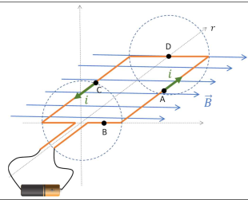
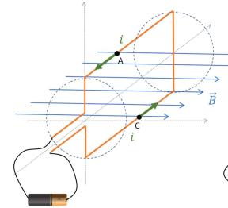
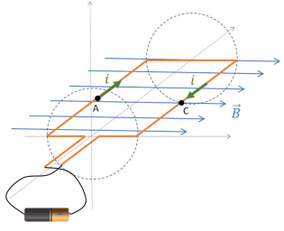
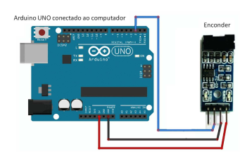

# Lab 2 - Direct Current Motor and Generator

Lesson Learning Objectives:

- [x] Understand and explain, using the Lorentz force equation, the working principle of a direct current motor.
- [x] Understand and explain, using Faraday's law of induction, the working principle of a direct current generator.
- [x] Understand and explain, using electrical and mechanical power equations, the principle of energy conservation in a DC motor/generator set.

## Conceptual Basis of the Electric Motor

!!! video
    

In theoretical classes, we learned that an electrical charge in motion, immersed in an electromagnetic field, is subject to a force called Lorentz force, whose equation is given by:

$$
\overrightarrow{F} = q . (\overrightarrow{E} + v \times B)
$$

Consider a winding of conducting wire covered by an electric current, immersed in a region where there is a horizontal magnetic field to the right (produced by permanent magnets), uniform and constant in time, as shown in the figure. In the figure, mark the Lorentz force at points A, B, C and D of the winding, remembering that the electric current can be understood as the flow of positive charges along the wire. Indicate the direction of rotation of this winding around the axis.



!!! info
    Also note the direction of touch caused by each force and the direction of angular velocity to be acquired by the winding.

The winding would rotate clockwise, right? This is the working principle of an electric motor. In the illustration below, we show the same winding rotated, in the figure on the left, by 90° to the starting position and, in the right, by 180° to the starting position. Mark the forces acting at points A and C in both figures. Based on the questions, write your conclusions in the space below.

!!! question choice
    Considering the image below, select the correct answer.
    
        
    
    - [x] There is torque in this position
    - [ ] There is **no** torque in this position
    
    Answer below:
    !!! details
        In the future we will add a tool that will allow the student to draw on a figure:
        
        - https://github.com/insper-education/active-handout/issues/7

!!! question short
    1. Is the applied torque in the same direction as the angular speed of the motor?
    1. In this position, what would it take to make the torque go in the direction of angular velocity?
    
    
    
    Answer below:
    !!! details
        Explanation goes here...

You must have understood the need for us to use several windings arranged in planes with different inclinations, which can be switched on and off depending on the position. We call this set of windings “motor armature”. 

At this point, your teacher will give a brief demonstration of how the DC motor works.

!!! progress
    Click after your teacher's explanation.

## Experiment

Connect the Arduino to your laptop's USB input and, using jumpers, connect Arduino's 5V, GND and Digital Input 2 pins, respectively, to the Encoder's VCC, GND and D0 pins, as shown in the figure.



!!! warning
    Pay attention to the correct connection

Then run the following code on the arduino:

??? info "code"
    ```c
    //Programa: Sensor de velocidade Arduino LM393
    //Autor: Arduino e Cia
    //ultima versao: Carareto 26/07/2019

    double tempoAmostrando = 1000;
    int pino_D0 = 2;
    int rpm;
    volatile byte pulsos;
    unsigned long timeold;

    //Altere o numero abaixo de acordo com o numero de fendas do seu disco encoder
    unsigned int pulsos_por_volta = 1;

    //funcao executada pela interrupcao
    void contador()
    {
      //Incrementa contador toda vez que uma fenda passa pelo detector de luz
      pulsos++;
    }

    void setup()
    {
      Serial.begin(9600);
      //Pino do sensor como entrada para detectar a interrupcao (passagem da fenda no sensor                  //de luz)
      pinMode(pino_D0, INPUT);

      //declara a interrupcao: a cada caída de tensao (FALLING) no pino_D0, a funcao //contador será executada.
      attachInterrupt(digitalPinToInterrupt(pino_D0), contador, FALLING);

      pulsos = 0;
      rpm = 0;
      timeold = 0;
    }


    // a cada intervalo de tempo igual ao valor de "tempoAmostrado" (em milisegundos) ha um  //plot em serial do valor da toracao em rpm
    void loop()
    {
      if (millis() - timeold >= tempoAmostrando)
      {
        //Desabilita interrupcao durante o calculo
        detachInterrupt(0);
        rpm = (60 * 1000 / pulsos_por_volta ) / (millis() - timeold) * pulsos;
        timeold = millis();
        //Mostra o valor de RPM no serial monitor
        Serial.print("RPM = ");
        Serial.println(rpm, DEC);
        pulsos =0;
        //Habilita interrupcao
        attachInterrupt(0, contador, FALLING);
      }
    }
    ```
